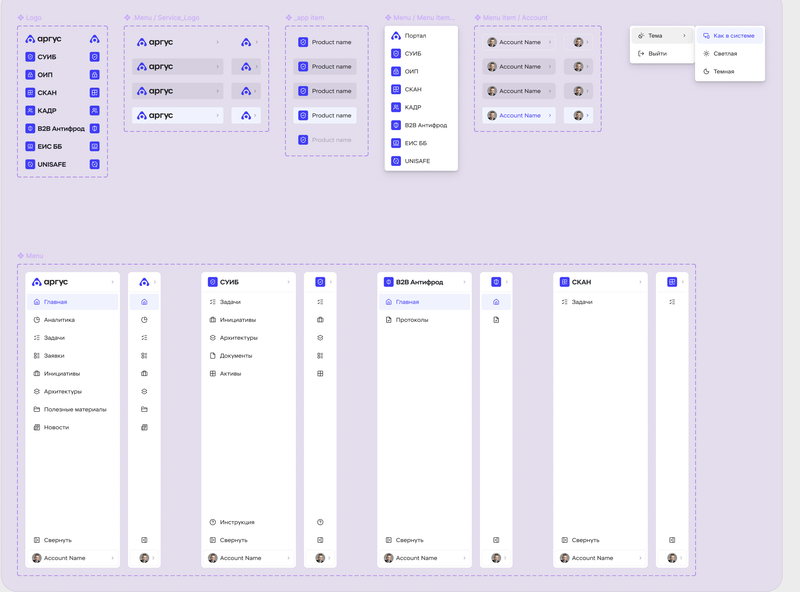

# Argus portal and subsystem context

Status: preliminary input, to be extended with additional screenshots and
architecture notes.



## Product role

Argus is a common entry environment and information aggregator. It may display
cross-system content such as news, statistics, requests, initiatives, and tasks.
It also provides navigation into autonomous subsystems.

The subsystems have their own domain navigation and features, but share a common
design system and application-shell language.

## Architectural interpretation for the design sandbox

The Argus Storybook should model three distinct layers:

1. **Shared design system** — tokens and reusable UI components.
2. **Shared application shell** — service identity, application switcher,
   sidebar, account menu, theme menu, and common layout behavior.
3. **Domain modules** — Argus portal and each autonomous subsystem, including
   their navigation configuration, pages, data, and scenarios.

This is a documentation and prototyping boundary. It does not prescribe whether
production systems use a monolith, micro-frontends, or separate applications.

## Shared shell model

The screenshot indicates that one shell is configured rather than copied for
each system. Its primary parts are:

- `AppShell`;
- `ServiceLogo`;
- `AppSwitcher`;
- `AppSwitcherItem`;
- `Sidebar`;
- `NavigationList`;
- `NavigationItem`;
- `AccountMenu`;
- `ThemeMenu`;
- expanded and collapsed sidebar modes.

Subsystem-specific navigation should be data-driven. A subsystem supplies its
identity and navigation configuration to the shared shell instead of owning a
separate hard-coded sidebar implementation.

## Systems observed in the supplied reference

The following names are transcribed from the screenshot and remain subject to
confirmation:

- Argus / Portal;
- СУИБ;
- ОИП;
- СКАН;
- КАДР;
- B2B Антифрод;
- ЕИС ББ;
- UNISAFE.

## Navigation examples observed

### Argus

- Главная;
- Аналитика;
- Задачи;
- Заявки;
- Инициативы;
- Архитектуры;
- Полезные материалы;
- Новости.

### СУИБ

- Задачи;
- Инициативы;
- Архитектуры;
- Документы;
- Активы;
- Инструкция.

### B2B Антифрод

- Главная;
- Протоколы.

### СКАН

- Задачи.

These lists describe the supplied reference, not an approved final information
architecture.

## Application registry

The sandbox should maintain one canonical registry for system identity and shell
configuration:

```ts
interface ApplicationDefinition {
  id: string;
  name: string;
  shortName?: string;
  icon: string;
  entryUrl: string;
  navigation: NavigationItemDefinition[];
  capabilities: string[];
}
```

The registry enables consistent naming, icons, switcher ordering, navigation,
and mocked access scenarios. Environment-specific production URLs are outside
the design contract.

## Role-aware aggregation

Argus aggregates records from systems available to the current user. Access and
record data must remain separate concepts:

```ts
interface UserAccessContext {
  userId: string;
  applicationIds: string[];
  rolesByApplication: Record<string, string[]>;
  capabilities: string[];
}

interface AggregatedTask {
  id: string;
  sourceApplicationId: string;
  title: string;
  status: string;
  createdAt: string;
  assigneeId?: string;
}
```

The task list is derived by applying the access context to records from multiple
subsystems. Stories should never remove inaccessible tasks manually inside a UI
component; they should provide an access scenario and let the aggregation
layer produce the visible data set.

## Required Storybook scenarios

### Application shell

- Argus, expanded sidebar;
- Argus, collapsed sidebar;
- each subsystem identity and navigation configuration;
- active and inactive navigation items;
- long application and account names;
- light, dark, and system themes;
- account with and without an avatar;
- switcher with all systems;
- switcher limited by access rights;
- unavailable or disabled subsystem.

### Aggregated tasks

- tasks from one available subsystem;
- tasks from multiple available subsystems;
- user with access to systems 1 and 2 only;
- no available tasks;
- unavailable source system;
- mixed task statuses;
- loading, partial loading, and error by source;
- identical field terminology across source systems.

## Storybook navigation proposal

```text
Foundations/
Components/
Shell/
  App switcher
  Sidebar
  Account menu
Patterns/
  Aggregated task list
Portal/
  Argus
Subsystems/
  СУИБ
  ОИП
  СКАН
  КАДР
  B2B Антифрод
  ЕИС ББ
  UNISAFE
Data Dictionary/
```

## Open architecture inputs

The following items will be resolved from future notes and screenshots:

- confirmed subsystem names and scope;
- whether transitions open inside one shell, replace the application, or open a
  new browser context;
- ownership and source of application navigation configuration;
- role and capability vocabulary;
- whether aggregated tasks share one detail model or link to source-system
  details;
- which shell regions are mandatory for every subsystem;
- mobile and narrow-screen behavior;
- authentication and account-switching expectations.
