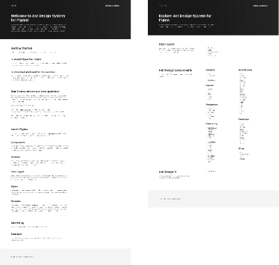
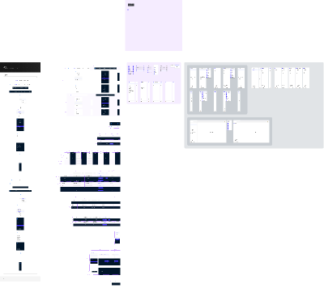

# Первичная инвентаризация библиотек ANT и Argus

Дата проверки: 2026-09-07.

Статус: предварительная автоматизированная инвентаризация. Она описывает
структуру файлов, но ещё не является утверждённым списком компонентов или
токенов для реализации.

## Полученные библиотеки

| Показатель | ANT | Argus |
| --- | ---: | ---: |
| Размер файла | 45 341 399 байт | 66 335 044 байта |
| Узлы документа | 92 540 | 131 576 |
| Страницы (`CANVAS`) | 93 | 105 |
| Компоненты и варианты (`SYMBOL`) | 13 964 | 21 813 |
| Экземпляры (`INSTANCE`) | 25 247 | 40 827 |
| Переменные | 2 337 | 4 006 |
| Коллекции переменных | 8 | 30 |
| Вложенные изображения | 98 | 173 |

## Связь двух библиотек

В Argus сохранились идентификаторы 86 139 узлов ANT. Это подтверждает, что
Argus является производной библиотекой, а не независимой системой.

- узлов только в ANT: 6 401;
- узлов только в Argus: 45 437;
- новых публикуемых компонентов и вариантов в Argus: 831;
- новых страниц в Argus: 25;
- отсутствующих по идентификатору страниц ANT: 13.

Эти числа нельзя напрямую трактовать как количество осмысленных продуктовых
изменений: часть узлов относится к экземплярам, служебным элементам, вариантам,
копиям и импортированным библиотекам.

## Новые содержательные страницы Argus

Среди страниц, отсутствующих в исходном файле ANT, обнаружены:

- `A R G U S`;
- `News`;
- `Header`;
- `Search Input`;
- `Layout`;
- `Icons Lucide`;
- `Scroll area`;
- `Dashboard cards`;
- `Mainpage`;
- `Context menu`;
- `List`;
- `Collapse`;
- `Drawer`;
- `Datagrid settings`;
- `Элементы для оформления`;
- `Change Log`.

Символы `🟣`, `⚪` и `⚒️` в названиях страниц пока рассматриваются как часть
авторской классификации. Их значение необходимо подтвердить перед тем, как
использовать эту классификацию в Storybook.

## Где сосредоточены новые публикуемые варианты

| Страница | Новые публикуемые символы |
| --- | ---: |
| Internal Only Canvas | 296 |
| Table | 147 |
| Icons Lucide | 145 |
| Menu | 46 |
| Элементы для оформления | 33 |
| Context menu | 24 |
| List | 21 |
| Datagrid settings | 18 |
| Mainpage | 17 |
| Drawer | 15 |
| Header | 10 |
| News | 10 |

Меньшие наборы также найдены в Scroll area, Switch, Upload, Collapse,
Pagination, Layout, Dashboard cards, Tag, Empty, Typography и Badge.

Это указывает, что первый Argus-слой Storybook должен уделить особое внимание
навигации, таблицам, меню, спискам и оболочке приложения, а не ограничиваться
только Button и Input.

## Токенная основа

В основной коллекции цветов Argus обнаружены режимы:

- `ARGUS Light`;
- `ARGUS Dark`.

Коллекция компонентов использует режим `ARGUS`. Коллекции размеров и типографики
сохраняют режимы `Default` и `Compact`.

Также присутствуют дополнительные и импортированные коллекции, включая
`Product colors`, `Theme`, `Colors`, `Color Styles` и другие внешние ссылки.
Часть переменных представлена алиасами на исходные или импортированные
коллекции. Поэтому `.fig` достаточно для инвентаризации, но для устойчивой
сборки токенов всё ещё нужен исходный JSON-экспорт из рабочего Figma-плагина.

## Типографика

Наиболее часто используемые семейства в Argus:

| Семейство | Найдено текстовых или стилевых узлов |
| --- | ---: |
| X5 Sans VF | 10 863 |
| X5 Sans UI | 629 |
| SF Pro Text | 8 776 |
| Inter | 2 571 |

В ANT преобладает `SF Pro Text`, тогда как в Argus основным становится
`X5 Sans VF`. При этом значительный объём SF Pro Text и Inter остаётся. Перед
реализацией нужно определить, где это осознанное наследование, а где следы
неполной миграции.

Для браузерного воспроизведения понадобятся разрешённые к web-hosting файлы и
начертания X5 Sans VF/X5 Sans UI либо согласованный fallback.

## Предварительный приоритет атомарного Storybook

1. Цветовые режимы Argus Light и Argus Dark.
2. Типографика X5 Sans и правила наследования ANT.
3. Размеры, интервалы, радиусы и режим Compact.
4. Иконки ANT и Lucide.
5. Button, Input, Select, Checkbox, Radio и Switch.
6. Badge, Tag, Tooltip, Avatar, Empty и Upload.
7. Menu, Context menu и Pagination.
8. Table, List и Datagrid settings.
9. Header, Layout и общая оболочка приложения.

## Риски, требующие решения

- исходные `.fig` весят 45 и 66 МБ; их следует хранить через Git LFS, которого
  пока нет в локальном окружении;
- в Argus одновременно используются несколько шрифтов;
- присутствуют дублирующиеся и внешние коллекции переменных;
- не определена семантика маркеров в названиях страниц;
- автоматический diff узлов не отделяет служебные изменения от утверждённых
  дизайн-решений;
- отсутствует JSON-экспорт токенов, пригодный для стабильной нормализации.

## Следующие входные данные

Для перехода к реализации нужны:

1. JSON-экспорт токенов Argus из используемого плагина;
2. по возможности аналогичный экспорт ANT;
3. название и настройки плагина;
4. файлы и лицензионные ограничения X5 Sans;
5. расшифровка маркеров `🟣`, `⚪`, `⚒️`;
6. подтверждение, какие страницы считаются актуальными и готовыми к переносу.

